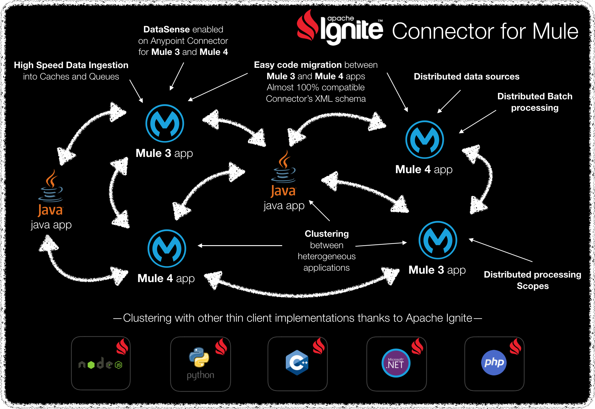

# Mule 3 Examples

_[Apache Ignite®](https://ignite.apache.org) is a memory-centric distributed database, caching, and processing platform for
transactional, analytical, and streaming workloads, delivering in-memory speeds at petabyte scale._

*All company names, logos, brand names and trademarks are property of
their respective owners. All company, product and service names used in
this website are for identification purposes only.*

## Content

* [exclusive-access](exclusive-access/README.md): learn how to provide
exclusive access to a resource, a processor chain in Mule, by using the
Apache Ignite connector.
* [dummy-cache-cluster](dummy-cache-cluster/README.md): this example is
used at the [Setup a Development Environment](https://docs.hawkore.com/private/tutorials/en/latest/apache-Ignite-connector-mule3/setup-development-environment/)
tutorial.

# Other resources

Sign up at [www.hawkore.com](https://www.hawkore.com) to access full
documentation.

- [Product documentation](https://docs.hawkore.com/private/apache-ignite-connector-mule3/)
- [Tutorials](https://docs.hawkore.com/private/tutorials/)
- [Apache Ignite Connector for Mule 3](https://www.hawkore.com/plugins/product/pl-g-big-data/pl-t-ignite/pl-p-ignitev3) examples
